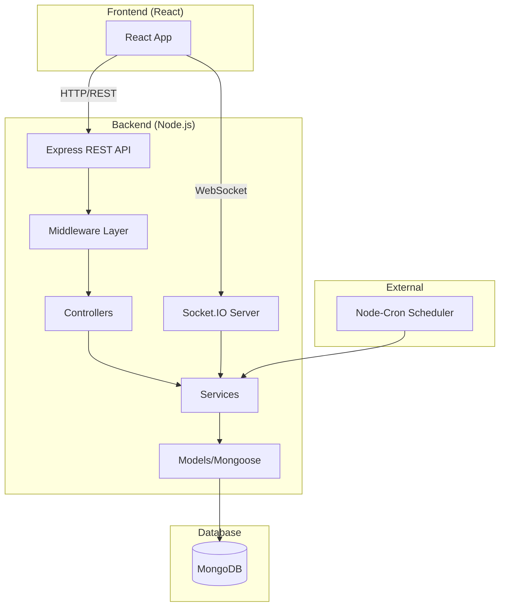

# Design Document

## Overview

This document describes the technical design for the auction platform backend. The system is built using Node.js with Express.js for the REST API, Socket.IO for real-time communication, and MongoDB for data persistence. The architecture follows a layered approach with clear separation between routes, controllers, services, and data models.

## Architecture



### Directory Structure

```
backend/
├── src/
│   ├── config/
│   │   ├── db.js              # MongoDB connection
│   │   └── socket.js          # Socket.IO configuration
│   ├── middleware/
│   │   ├── auth.js            # JWT authentication
│   │   ├── roleCheck.js       # Role-based authorization
│   │   └── errorHandler.js    # Global error handling
│   ├── models/
│   │   ├── User.js            # User schema
│   │   ├── Auction.js         # Auction schema
│   │   └── Settings.js        # Platform settings schema
│   ├── routes/
│   │   ├── auth.js            # Authentication routes
│   │   ├── users.js           # User management routes
│   │   ├── auctions.js        # Auction routes
│   │   └── admin.js           # Admin routes
│   ├── controllers/
│   │   ├── authController.js
│   │   ├── userController.js
│   │   ├── auctionController.js
│   │   └── adminController.js
│   ├── services/
│   │   ├── auctionService.js  # Auction business logic
│   │   ├── socketService.js   # Socket event handlers
│   │   └── schedulerService.js # Cron jobs
│   └── app.js                 # Express app setup
├── .env                       # Environment variables
├── package.json
└── server.js                  # Entry point
```

## Components and Interfaces

### REST API Endpoints

#### Authentication (`/api/auth`)

| Method | Endpoint    | Description       | Auth Required |
| ------ | ----------- | ----------------- | ------------- |
| POST   | `/register` | Register new user | No            |
| POST   | `/login`    | Login user        | No            |
| GET    | `/me`       | Get current user  | Yes           |

#### Users (`/api/users`)

| Method | Endpoint              | Description                 | Auth Required |
| ------ | --------------------- | --------------------------- | ------------- |
| GET    | `/`                   | Get all users               | Admin         |
| GET    | `/:id`                | Get user by ID              | Admin         |
| PUT    | `/:id`                | Update user                 | Admin         |
| DELETE | `/:id`                | Delete user                 | Admin         |
| POST   | `/seller-request`     | Submit seller request       | Yes           |
| GET    | `/pending-sellers`    | Get pending seller requests | Admin         |
| PUT    | `/:id/approve-seller` | Approve seller              | Admin         |
| PUT    | `/:id/reject-seller`  | Reject seller               | Admin         |

#### Auctions (`/api/auctions`)

| Method | Endpoint             | Description                     | Auth Required   |
| ------ | -------------------- | ------------------------------- | --------------- |
| GET    | `/`                  | Get all auctions (with filters) | No              |
| GET    | `/:id`               | Get auction by ID               | No              |
| POST   | `/`                  | Create auction                  | Seller          |
| PUT    | `/:id`               | Update auction                  | Owner/Admin     |
| DELETE | `/:id`               | Delete auction                  | Admin           |
| POST   | `/:id/bid`           | Place bid                       | Yes (non-admin) |
| DELETE | `/:id/bid/:bidIndex` | Remove bid                      | Admin           |
| GET    | `/user/:userId`      | Get user's auctions             | Yes             |

#### Admin (`/api/admin`)

| Method | Endpoint            | Description              | Auth Required |
| ------ | ------------------- | ------------------------ | ------------- |
| GET    | `/settings`         | Get platform settings    | Admin         |
| PUT    | `/settings`         | Update platform settings | Admin         |
| PUT    | `/commission-rate`  | Update commission rate   | Admin         |
| GET    | `/categories`       | Get categories           | No            |
| POST   | `/categories`       | Add category             | Admin         |
| DELETE | `/categories/:name` | Delete category          | Admin         |
| POST   | `/announcements`    | Create announcement      | Admin         |
| GET    | `/announcements`    | Get announcements        | No            |

### Socket.IO Events

#### Client to Server Events

| Event          | Payload                                          | Description        |
| -------------- | ------------------------------------------------ | ------------------ |
| `newBid`       | `{ auctionId, bidAmount, bidderName, bidderId }` | New bid placed     |
| `joinAuction`  | `{ auctionId }`                                  | Join auction room  |
| `leaveAuction` | `{ auctionId }`                                  | Leave auction room |

#### Server to Client Events

| Event                   | Payload                                                    | Description             |
| ----------------------- | ---------------------------------------------------------- | ----------------------- |
| `bidUpdate`             | `{ auctionId, newPrice, bidderId, bidderName, timestamp }` | Bid update broadcast    |
| `auctionEnded`          | `{ auctionId, winnerId, winnerName }`                      | Auction ended           |
| `auctionCreated`        | `{ auction }`                                              | New auction created     |
| `auctionUpdated`        | `{ auctionId, updates }`                                   | Auction updated         |
| `auctionRemoved`        | `{ auctionId }`                                            | Auction removed         |
| `userUpdated`           | `{ userEmail, updates }`                                   | User status changed     |
| `outbid`                | `{ auctionId, newPrice, bidderName }`                      | Outbid notification     |
| `commissionRateUpdated` | `{ commissionRate }`                                       | Commission rate changed |

## Data Models

### User Schema

```javascript
{
  username: { type: String, required: true, unique: true },
  email: { type: String, required: true, unique: true },
  password: { type: String, required: true }, // bcrypt hashed
  role: { type: String, enum: ['bidder', 'seller', 'admin'], default: 'bidder' },
  isValidated: { type: Boolean, default: true },
  isAdmin: { type: Boolean, default: false },
  sellerStatus: { type: String, enum: ['none', 'pending', 'approved', 'rejected'], default: 'none' },
  status: { type: String, enum: ['active', 'suspended', 'banned'], default: 'active' },

  // Profile fields
  name: { type: String },
  phone: { type: String },
  address: { type: String },
  profilePhoto: { type: String },

  // Seller request fields
  businessName: { type: String },
  businessType: { type: String },
  description: { type: String },
  experience: { type: String },
  website: { type: String },
  requestedAt: { type: Date },

  // Activity tracking
  bids: [{ type: mongoose.Schema.Types.ObjectId, ref: 'Auction' }],
  wonItems: [{ type: mongoose.Schema.Types.ObjectId, ref: 'Auction' }],

  createdAt: { type: Date, default: Date.now },
  updatedAt: { type: Date, default: Date.now }
}
```

### Auction Schema

```javascript
{
  title: { type: String, required: true },
  description: { type: String, required: true },
  category: { type: String, required: true },
  startingPrice: { type: Number, required: true },
  currentPrice: { type: Number, required: true },
  image: { type: String },
  endTime: { type: Date, required: true },
  status: { type: String, enum: ['active', 'ended', 'cancelled'], default: 'active' },

  seller: { type: mongoose.Schema.Types.ObjectId, ref: 'User', required: true },
  sellerName: { type: String },

  winnerId: { type: mongoose.Schema.Types.ObjectId, ref: 'User' },
  winnerName: { type: String },

  bids: [{
    bidderId: { type: mongoose.Schema.Types.ObjectId, ref: 'User' },
    bidderName: { type: String },
    amount: { type: Number, required: true },
    timestamp: { type: Date, default: Date.now }
  }],

  createdAt: { type: Date, default: Date.now },
  updatedAt: { type: Date, default: Date.now }
}
```

### Settings Schema

```javascript
{
  commissionRate: { type: Number, default: 0.05 },
  categories: [{ type: String }],
  siteRules: {
    defaultAuctionDuration: { type: Number, default: 24 },
    minBidIncrement: { type: Number, default: 100 },
    maxAuctionDuration: { type: Number, default: 168 },
    minStartingPrice: { type: Number, default: 10 }
  },
  announcements: [{
    title: { type: String },
    message: { type: String },
    priority: { type: String, enum: ['low', 'medium', 'high'] },
    active: { type: Boolean, default: true },
    createdAt: { type: Date, default: Date.now }
  }],
  updatedAt: { type: Date, default: Date.now }
}
```

## Correctness Properties

_A property is a characteristic or behavior that should hold true across all valid executions of a system-essentially, a formal statement about what the system should do. Properties serve as the bridge between human-readable specifications and machine-verifiable correctness guarantees._

### Property 1: Authentication Round-Trip

_For any_ valid user registration data, registering a user and then logging in with the same credentials should return a valid JWT that, when used to access the /me endpoint, returns the same user data.
**Validates: Requirements 1.1, 1.2, 1.3**

### Property 2: Password Security

_For any_ user created in the system, the stored password should not equal the plaintext password and should be verifiable using bcrypt.compare.
**Validates: Requirements 1.6**

### Property 3: User List Completeness

_For any_ set of users created in the system, an admin request to get all users should return a list containing all created users.
**Validates: Requirements 2.1**

### Property 4: User Status Update Consistency

_For any_ user and any status transition (active→suspended, active→banned, suspended→active, banned→active), updating the user's status should persist the new status in the database.
**Validates: Requirements 2.2, 2.3**

### Property 5: User Deletion Completeness

_For any_ user deleted by an admin, subsequent queries for that user should return no results.
**Validates: Requirements 2.4**

### Property 6: Seller Approval Workflow Consistency

_For any_ user with a pending seller request, approving should set role to 'seller' and isValidated to true, while rejecting should set sellerStatus to 'rejected'.
**Validates: Requirements 3.2, 3.3**

### Property 7: Pending Sellers Filter Accuracy

_For any_ set of users with various seller statuses, the pending sellers endpoint should return exactly those users with sellerStatus='pending'.
**Validates: Requirements 3.4**

### Property 8: Auction End Time Calculation

_For any_ auction created with a duration in hours, the end time should equal the creation time plus the duration converted to milliseconds.
**Validates: Requirements 4.1**

### Property 9: Auction Filter Correctness

_For any_ set of auctions and any filter criteria (category, price range, status), the filtered results should contain only auctions matching all specified criteria.
**Validates: Requirements 4.2**

### Property 10: Bid Validity and Price Update

_For any_ active auction and any bid amount greater than the current price, placing the bid should update the auction's current price to the bid amount and add the bid to the bid history.
**Validates: Requirements 5.1**

### Property 11: Bid Removal Price Recalculation

_For any_ auction with multiple bids, removing a bid should recalculate the current price to be the maximum of the remaining bids or the starting price if no bids remain.
**Validates: Requirements 5.5**

### Property 12: Auction Lifecycle Completion

_For any_ auction whose end time has passed, the scheduler should update its status to 'ended' and set the winner to the highest bidder if bids exist.
**Validates: Requirements 6.1, 6.2**

### Property 13: Settings Persistence

_For any_ settings update (commission rate, categories, site rules), the updated values should be retrievable from the database.
**Validates: Requirements 8.1, 8.2, 8.3**

### Property 14: JSON Round-Trip

_For any_ valid API request/response data, serializing to JSON and deserializing should produce equivalent data.
**Validates: Requirements 9.4, 9.5**

### Property 15: Schema Validation Enforcement

_For any_ user or auction data missing required fields, the database should reject the creation with a validation error.
**Validates: Requirements 9.1, 9.2**

## Error Handling

### HTTP Error Responses

| Status Code | Description           | Use Case                                        |
| ----------- | --------------------- | ----------------------------------------------- |
| 400         | Bad Request           | Invalid input data, validation errors           |
| 401         | Unauthorized          | Missing or invalid JWT token                    |
| 403         | Forbidden             | Insufficient permissions for the action         |
| 404         | Not Found             | Resource does not exist                         |
| 409         | Conflict              | Duplicate resource (e.g., email already exists) |
| 500         | Internal Server Error | Unexpected server errors                        |

### Error Response Format

```javascript
{
  success: false,
  message: "Human-readable error message",
  errors: [
    { field: "email", msg: "Email already exists" }
  ]
}
```

### Global Error Handler

```javascript
function errorHandler(err, req, res, next) {
  console.error(err.stack)

  if (err.name === 'ValidationError') {
    return res.status(400).json({
      success: false,
      message: 'Validation Error',
      errors: Object.values(err.errors).map((e) => ({ msg: e.message })),
    })
  }

  if (err.name === 'JsonWebTokenError') {
    return res.status(401).json({
      success: false,
      message: 'Invalid token',
    })
  }

  res.status(err.status || 500).json({
    success: false,
    message: err.message || 'Internal Server Error',
  })
}
```

## Testing Strategy

### Dual Testing Approach

The backend will use both unit tests and property-based tests to ensure correctness:

1. **Unit Tests (Jest)**: Verify specific examples, edge cases, and error conditions
2. **Property-Based Tests (fast-check)**: Verify universal properties across random inputs

### Testing Framework

- **Jest**: Primary testing framework for unit and integration tests
- **fast-check**: Property-based testing library for JavaScript
- **supertest**: HTTP assertions for API endpoint testing
- **mongodb-memory-server**: In-memory MongoDB for isolated testing

### Test Structure

```
backend/
├── tests/
│   ├── unit/
│   │   ├── models/
│   │   │   ├── User.test.js
│   │   │   └── Auction.test.js
│   │   ├── services/
│   │   │   └── auctionService.test.js
│   │   └── middleware/
│   │       └── auth.test.js
│   ├── integration/
│   │   ├── auth.test.js
│   │   ├── auctions.test.js
│   │   └── socket.test.js
│   ├── properties/
│   │   ├── auth.property.test.js
│   │   ├── auction.property.test.js
│   │   └── bidding.property.test.js
│   └── setup.js
```

### Property-Based Test Configuration

Each property test should run a minimum of 100 iterations to ensure adequate coverage. Tests should be annotated with the correctness property they implement:

```javascript
// **Feature: auction-backend, Property 10: Bid Validity and Price Update**
test('valid bids update auction price', () => {
  fc.assert(
    fc.property(
      auctionArbitrary,
      fc.integer({ min: 1, max: 1000000 }),
      (auction, bidIncrement) => {
        const bidAmount = auction.currentPrice + bidIncrement
        const result = placeBid(auction, bidAmount)
        return result.currentPrice === bidAmount
      }
    ),
    { numRuns: 100 }
  )
})
```

### Test Coverage Goals

- Unit tests: Cover all controller methods and service functions
- Property tests: Cover all 15 correctness properties
- Integration tests: Cover all API endpoints and socket events
- Edge cases: Cover all error conditions and boundary cases
